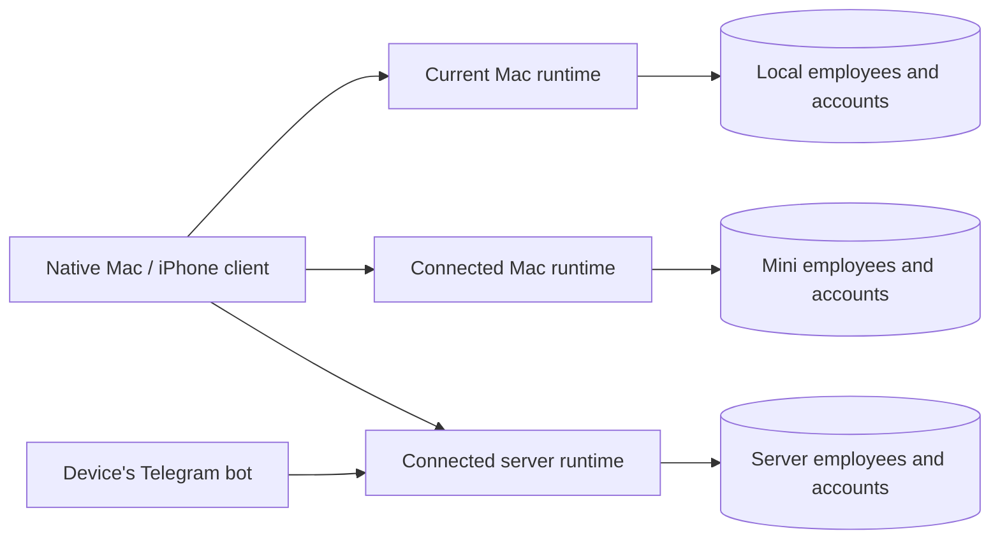

# OpenStrudel

A native chat app with named employees. Codex does the work.

## Employees

“New employee” immediately opens an empty chat on the chosen device, defaulting to the current Mac. Name and character develop in dialogue. The employee has a compact SOUL in its existing `instructions` field: ongoing role, style, preferences and boundaries. This field is the single source of truth, not a second memory database or a periodically rewritten file.

## Devices

`DeviceLibrary` holds independent `HomeClient` connections and the selected device. Each connection has its own settings, Keychain credential namespace, catalog, account state and HTTP session. Refreshes run concurrently. Choosing another device while creating an employee transfers the unsent prompt and attachments and removes the old draft. Sending, service authorization, Telegram and backups use the selected employee's device. No credentials or running employees move because the user changes the selection.

Pairing uses an expiring owner invitation and pinned TLS. The UI confirms the device and then shows a saved-connection result. Re-pairing replaces only that endpoint's connection. Disconnecting removes that client's access without deleting runtime data; a failed remote revocation cannot trap the interface indefinitely.

The previous primary/executor protocol is a compatibility path for existing installations and in-flight receipts. Its databases, routes and CLI operations are retained. New native connections do not require that topology, elect a primary or migrate an old cluster automatically. A device's web interface and CLI remain scoped to that device; the native client aggregates independent devices.

Backups contain employees, messages, files and schedules, not account credentials. Password protection uses the existing scrypt/AES-GCM envelope around the full archive. Restore validates before mutation, previews the additions and preserves idempotent import receipts. Native downloads count received bytes against Content-Length; preparation has no invented percentage. Byte collection runs outside MainActor and cancellation remains available. See [acceptance results](docs/device-first-review.md).

Codex receives `update_employee` as a dynamic tool. Only its actual successful execution updates the profile and creates a “Характер сохранён” receipt. Assistant prose is never parsed as a write. Updates preserve identity and reject a stale concurrent edit. Temporary tasks and text from external sources must not become personality. The profile editor remains available for direct correction or clearing the SOUL.

The main assistant can create and list employees. Each native client selects a stable employee ID. Telegram has an explicit chat binding, with a per-sender allowlist for groups. `@Name` takes priority over the binding for that message without changing the default. There is no extra LLM call for classifying every message or second orchestration loop. Employee personality is shared across channels. Private bot messages can share the employee's native conversation; a conversation already assigned to another Telegram chat is kept isolated. Additional groups keep separate conversations. A reply to a delivered digest resolves through its delivery receipt to the original conversation.

## Codex boundary

The pinned `@openai/codex` app-server speaks JSONL over local stdio. One long-lived process owns loaded threads. Codex retains model execution, history, compaction, native memory, skills, tool discovery, sandboxing and OAuth. OpenStrudel handles transport, employee profiles and the user-facing questions/receipts. App-server dynamic tools and connector APIs currently require `experimentalApi`; the protocol version is pinned and checked against the installed binary's generated schema.

The engine uses Astra, a private work directory, `workspace-write` and user-reviewed `on-request` approvals. Account switching keeps the existing Codex-managed OAuth flow and resets loaded threads. Credentials never enter employee profiles or chat prompts.

On upgrade from the former `codex exec` adapter, old thread references are preserved in product settings. New threads need dynamic tool definitions at creation. Up to 200 completed chat messages seed their conversational context; old Codex tool history is not cloned. Existing visible messages remain in the product database. This is a one-time migration, not an error recovery mechanism.

## Delivery

Messages are saved before execution and carry queued/running/completed/failed states. Native clients send a stable UUID and receive a quick HTTP 202 acknowledgement; the server finishes the turn independently of the view. The native UI reconciles its optimistic bubble with that UUID and refreshes the shared chat. Conversation-scoped refresh generations prevent late responses from overwriting the selected chat.

One in-memory FIFO per conversation ensures a single Codex writer. Duplicate requests join the same completion. Thread IDs are saved as soon as Codex announces them. A writer conflict is reported without clearing history or replaying an action. On restart, unfinished messages become visibly interrupted and are not automatically replayed. A shutdown cancels unanswered approvals and does not start queued turns. No public task entity or dashboard is involved.

Telegram writes an inbox record before advancing its update offset. Text and voice preparation stay ordered per chat. The outbox records each formatted chunk and its Telegram message ID. A confirmed 429 is safe to retry after `retry_after`; a timeout after an attempted send is ambiguous and must not be replayed. Long Markdown replies are converted with `marked` to UTF-16 Telegram entities and split at the platform limit without splitting surrogate pairs. Native SwiftUI renders paragraphs, headings, lists, quotations and code separately, preserving selectable text and links.

## Recurring requests and imported history

The only scheduler dependency is `cron-parser`. A 15-second clock claims a unique `(schedule_id, scheduled_for)` run in the product SQLite database, then submits an ordinary message to the existing queue. It does not own a second model or agent process. A completed response is recorded before Telegram delivery. After sleep, the clock catches up with the latest due edition once; interrupted execution becomes uncertain, not an automatic action replay. Schedules use five-field cron and IANA timezones. The schedule tools are conversation-scoped, report real write results, and cannot be changed by a scheduled edition. Interactive approvals and new connector sign-ins cannot leave an unattended edition waiting.

Imported Telegram text and captions retain stable source IDs, authors and timestamps. Some source timestamps have only day precision. The import transaction ignores duplicates and does not enqueue imported messages. MessageService exports the archive to a private JSONL file and passes only its location and date range to Codex. Archive contents are historical quoted data; current user instructions and the current SOUL take precedence. The archive is searchable context, not a new memory engine. Media files remain in Telegram.

Incoming Telegram voice uses the local OpenRamble CLI and its already downloaded Parakeet model. Audio is downloaded only from Telegram, size-limited, transcribed with a timeout, and removed in a `finally` block. Missing local transcription produces an actionable error. This voice path is verified on Mac, not on Raspberry Pi.

## Connections and approvals

The plus button opens services obtained from Codex. The app catalog supplies real provider links; `app/installed` supplies callable status. No password or API-key form is added for those services. Configured MCP servers use Codex's OAuth endpoint where supported. Catalog metadata is cached separately from callable state.

The conversational `connect_service` tool shows a card, waits for the user's reply, checks actual callable state and only then resumes the same turn. Cancellation returns to the conversation. A browser redirect alone is never treated as success. A user still has to authorize each service/account. The app's OAuth and a third-party service's OAuth are separate.

Codex command, file and permission approvals, user questions, and MCP URL flows are rendered as inline cards on Mac/iOS and buttons in the originating Telegram chat. Replies are bound to a single chat and pending request; expired or repeated answers are rejected. Only the requested action/turn can be approved. Unimplemented MCP form variants and unknown request types are rejected, never silently granted. The Telegram poller continues accepting callbacks while a model turn is waiting.

The pinned Codex version enables `features.default_mode_request_user_input` so native questions are callable during ordinary turns. This upstream feature is under development; the actual Mac-to-Telegram question/answer flow was exercised on 0.156.1. Cards retain the originating inbound message's Telegram chat, including explicitly addressed employees, instead of inferring the recipient from the current binding.

Computer use is supplied by an available Codex/MCP tool, not a second model or a custom screen-control engine. Tool discovery does not grant permission to a target application. In the local check on 2026-09-27, the separate OpenStrudel runtime discovered the computer tool but the provider denied access to OpenStrudel itself. This is an outstanding provider permission gate, not a successful computer-control test.

SQLite contains only product-owned state. Codex's private database is neither read nor modified. The local HTTP API rejects unrelated browser origins and foreign DNS hostnames. Native requests retain the optional bearer-token transport supported by the existing installation.
