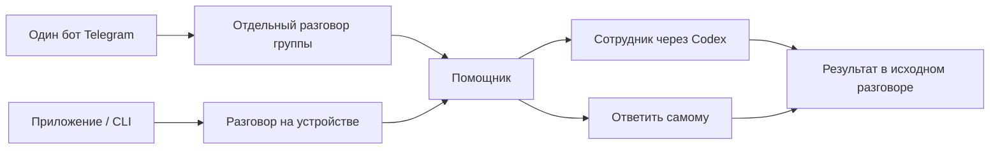

# Один вход, подходящий сотрудник

Актуализация требований 8 октября 2026. Продолжение [общей карты](navigation-stability-plan.md) и [режимов разрешений](approval-modes-and-navigation.md).

## Как это выглядит для человека

1. Открыть OpenStrudel, войти в OpenAI, написать задачу.
2. Общий помощник отвечает сам или привлекает подходящего сотрудника. Ответ остаётся в исходном разговоре. Если сотрудник участвовал, это понятно из ответа.
3. Telegram подключается один раз. Владелец добавляет бота в группу и обращается к нему. Отдельной обязательной настройки группы в OpenStrudel нет.
4. Существующие группы сохраняют своего сотрудника и правила. Волк в WAI Core Team продолжает работу с прежним характером, историей и инструментами.
5. Можно по-прежнему открыть сотрудника напрямую. Расширенные настройки доступны в его карточке, а не перед первым сообщением.

## Архитектура и границы

- Сотрудник живёт на своём устройстве. Подключение другого устройства не переносит данные и не назначает главный сервер.
- Telegram chat ID определяет аудиторию и историю. Модель выбирает помощника по задаче, но не определяет права доступа.
- Подключение группы разрешает ранее подтверждённый владелец бота. Добавление случайным человеком не открывает доступ к ресурсам владельца.
- Сотрудник работает в контексте текущей группы: тот же набор сервисов, проверенный отправитель и режим разрешений. Его личная история и личные подключения не подмешиваются.
- Используем нативные роли и делегирование Codex, если реальная проверка подтверждает передачу запросов разрешений и результатов. Не добавляем второй цикл исполнения или классификатор перед каждым сообщением.
- Простой запрос не требует делегирования. Поручения ограничены по параллелизму, завершённые помощники освобождаются. Повторное выполнение действий после неопределённого сетевого результата запрещено.
- Существующие правила сотрудника, включая подтверждение изменений CRM и расписания, сохраняются при любом режиме инструментов.

## Визуальная система

Решение: SF для содержания и управления; системный New York только для приветствия и коротких пустых состояний. SF Mono для кода. Сливочный светлый и графитовый тёмный фон; мягкий сливовый акцент для действий. Булочки дают характер через изображения, а не декоративные шрифты во всех подписях.

- Чат: удобная длина строки, стабильный межстрочный интервал, читаемый текст на непрозрачной поверхности.
- Иерархия: один заголовок экрана, понятные названия секций, спокойные подписи. Не более одного главного действия в блоке.
- Системные text styles, Dynamic Type, обычные начертания Regular / Medium / Semibold. Кнопки не уменьшают текст ради размещения.
- Liquid Glass — слой навигации и управления. История, инструкции, формы и документы остаются читаемыми. Учитываются Increase Contrast и Reduce Transparency.
- Все экраны: первый запуск, согласие на данные, вход, устройства, новый сотрудник, переписка, карточка, Telegram, сервисы, каталог, MCP, навыки, аккаунты, режимы, копии, выход, стирание, меню Mac.

## Очередь реализации и доказательств

- [x] Сверить официальные материалы Cursor и действующий протокол Codex.
- [x] Изучить Apple HIG Typography / Color и главы Practical Typography о тексте, размере, длине строки и интервалах.
- [x] Проверить настоящий нативный вызов сотрудника, возврат результата, разрешения и ограничение аудитории.
- [x] Реализовать выбор сотрудника по контексту в приложении, CLI и Telegram.
- [x] Новая группа начинает работать после добавления бота владельцем. Повторные события, удаление, возвращение, смена ID группы и существующие настройки покрыты тестами.
- [x] Упростить Telegram UI и убрать необходимость выбирать группу для обычного начала работы.
- [x] Применить типографику, ритм, цвета и ясную иерархию на всех перечисленных экранах; осмотреть реальные снимки.
- [x] Проверить чистый запуск, светлую/тёмную тему, узкое окно, крупный текст iPhone/iPad, клавиатуру и длинную историю.
- [x] Повторить замер памяти. Не заявлять причину прежних 30–40 GB без доказательства.
- [ ] Проверить реальную WAI Core Team разрешённым безвредным сообщением. Сверить доставку, инструменты, характер и отсутствие дублей.
- [ ] Обновить описание PR, собрать и проверить релиз, установить с резервной копией, проверить здоровье и откат. После приёмки объединить и опубликовать.

## Источники и применимость

- [Cursor: Subagents](https://cursor.com/docs/subagents): отдельный контекст помощника, выбор по специализации, возврат результата в основной разговор. Это ориентир для взаимодействия, а не готовая реализация маршрутизации Telegram.
- [Codex App Server](https://learn.chatgpt.com/docs/app-server), [параметры ролей](https://learn.chatgpt.com/docs/config-file/config-reference): сверяются со схемой установленной версии 0.156.1 и живыми пробами.
- [Apple: Typography](https://developer.apple.com/design/human-interface-guidelines/typography): системная пара SF / NY, семантические размеры, читаемость и адаптация.
- [Apple: Color](https://developer.apple.com/design/human-interface-guidelines/color): постоянное значение цвета, варианты светлой/тёмной темы и повышенного контраста.
- [Butterick: Typography in ten minutes](https://practicaltypography.com/typography-in-ten-minutes.html), [Body text](https://practicaltypography.com/body-text.html): сначала качество основного текста, затем декоративная иерархия. Типографические принципы применяем к интерфейсу с поправкой на нативные рекомендации Apple; размеры для печати не переносим в приложение.

Прочитаны указанные доступные главы и документация, не заявляется чтение книг целиком. Копии исследовательских материалов и закрытые доказательства тестов не входят в релиз.

## Приёмка кандидата 26

Закрытые результаты: `.data/routing-design-2026-10-08/`. Этот раздел дополняет, а не заменяет предыдущую проверку режимов, MCP и плагинов в [приёмке 25](approval-modes-and-navigation.md). Обязательная ручная привязка нового сотрудника к группе из прежних планов больше не нужна.

| Проверка | Результат |
| --- | --- |
| Настоящий Codex 0.156.1 | В одном родительском разговоре последовательно проверены прямой ответ и два нативных сотрудника с разными отправителями. Два вызова тестового MCP и два запроса разрешений получили правильного отправителя и исходную группу. `adapter-routing-final.log`, `adapter-routing-probe.json` |
| Запоздалый сотрудник | Тест отклоняет запрос помощника из предыдущего поручения. Завершённые нативные подписки освобождаются, история сохраняется. `tests/employee-routing.test.ts` |
| Runtime | Typecheck и 295 тестов в 46 файлах. `runtime-final.log` |
| Нативная логика | 112 тестов в 14 наборах, включая восстановление выбранной группы после перезапуска. `native-selection-verified.log` |
| iPhone | Чистое подключение Telegram, пауза/возврат без потери истории; полный проход настроек, приглашения, сервисов через браузер, редактирования, очереди, перезапуска и восстановления сети. `iPhone-clean-telegram.xcresult`, `iPhone-full-verified.xcresult` |
| iPad | Accessibility XXXL: основные экраны, доступные подписи и зоны нажатия; группа в списке чатов и переход к её сервисам без повторного выбора. `iPad-design-final.xcresult` |
| Mac | Computer Use: 5000 сообщений, первая страница 50, догрузка предыдущих с сохранением позиции, переключение групп и сотрудников. `audit/mac-pagination.png`, `audit/mac-telegram-dark.png` |
| Память | В этом сценарии footprint 126,7 MiB, пик 179,6 MiB, CPU в покое 0%. `memory-after-pagination.txt`. Наблюдение не доказывает причину ранее сообщённых 30–40 GB. |

Группа отображается отдельной строкой Telegram с её названием. Нажатие на заголовок открывает правила участия, сервисы и паузу именно этой группы. Общие настройки бота остаются в настройках устройства. Сообщение из приложения использует контекст группы, но ответ остаётся в OpenStrudel; это явно написано над полем ввода. Автоматическая публикация личного вопроса в Telegram не добавлялась.

UI-сценарии используют изолированные данные; OAuth в них заменён тестовым сервисом. Настоящие Codex/MCP проверены отдельно. Это не подтверждение всех внешних провайдеров, физических устройств или полного VoiceOver-прохождения человеком. Отдельный неудачный запуск iPad без подписи не имел доступа к Keychain; успешные прогоны используют стандартную подпись симулятора. Контроль CRM и расписания в действующем сотруднике не ослаблялся.
