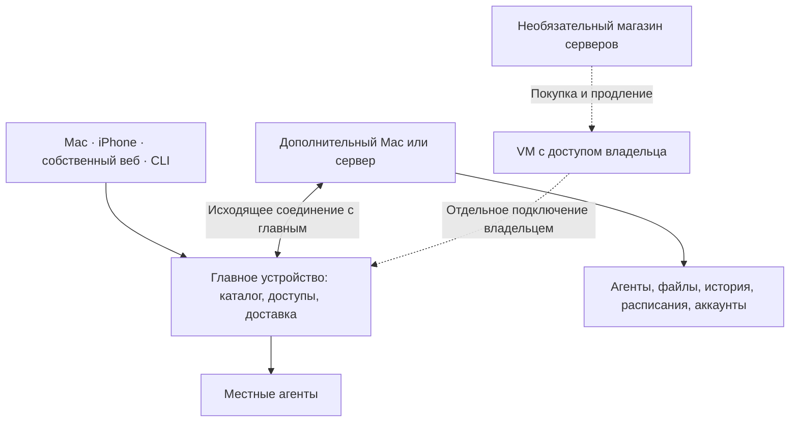
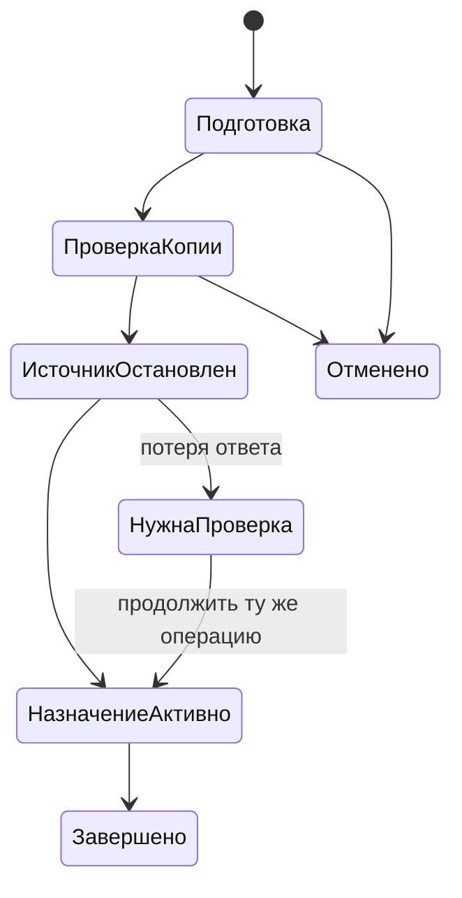

# Главное устройство OpenStrudel

Опубликовано 6 октября 2026 года: Mac 1.0 (13), Home 1.0-13 и iOS 1.0 (15)
в TestFlight. Код объединён в `main`. [Состав выпуска и проверки](releases/2026-10-06.md).
Покупка нового Home через магазин остаётся закрытой до отдельной живой приёмки.

## Как устроено

Пользователь выбирает одно главное устройство. Оно хранит каталог, доступы и
очередь доставки. Агенты работают на выбранных для них устройствах. Там остаются
их переписка, файлы, расписания и аккаунты OpenAI. Наш сайт и магазин не участвуют
в обычном соединении со своей командой.



Главное должно быть доступно клиентам и исполнителям. За NAT нужен собственный
сетевой доступ; скрытого relay нет. Выключение главного не выбирает другое
автоматически. Принятая исполнителем работа может продолжаться; новые сообщения
без подтверждения сохранения остаются черновиками.

## Что различается в интерфейсе

| Действие | Что меняется |
|---|---|
| Пригласить приложение | Доступ к готовой команде, без права выполнять код как новый узел |
| Добавить Mac или сервер | Подключение исполнителя; он не становится главным автоматически |
| Сделать главным | Перенос управления; агенты остаются на своих устройствах |
| Переместить агента | Одна активная копия с прежним ID, историей, файлами и расписаниями |
| Добавить из файла | Новые агенты; существующие сохраняются, импортированные расписания на паузе |
| Восстановить управление | Чистое устройство, зашифрованная копия и явное подтверждение изоляции прежнего главного |

В настройках находятся устройства, аккаунты Codex и копии. Меню Mac показывает
аккаунты выбранного устройства и остатки. Отсутствующий остаток обозначается как
неизвестный. Изменение приоритета действует на следующие поручения; начатое
поручение сохраняет свой аккаунт и контекст.

iOS подключается к готовой команде. Покупка, регистрация в магазине и добавление
нового размещения в iOS отсутствуют.

## CLI

`npm run build` собирает `dist/cli.js`. Установленный пакет предоставляет команду
`openstrudel`; в checkout можно использовать `node dist/cli.js`.

```sh
openstrudel help
openstrudel devices list --json
openstrudel home status --json
openstrudel accounts list --device DEVICE_ID --json
openstrudel accounts use ACCOUNT_ID --device DEVICE_ID
openstrudel agents list --json
openstrudel agents move AGENT_ID DEVICE_ID
openstrudel agents export --device DEVICE_ID --output team.openstrudel
openstrudel agents preview team.openstrudel
openstrudel agents import team.openstrudel
openstrudel home attempts --json
openstrudel servers help
```

Приглашение для `connect`, параметры создания, пароли копий и конфигурация магазина
поступают через stdin, а не аргументы оболочки. Не записывайте секреты в общий
репозиторий или журнал.

До отправки `message`, `agents create`, `agents move` CLI сохраняет UUID попытки и
выводит его в stderr. После потерянного ответа повторяют **ту же команду с тем же
`--request-id UUID`**. Другой текст, операция или устройство с прежним UUID
отклоняются до сети. `home attempts` показывает сохранённые идентификаторы, а не
объявляет действия выполненными. Журнал имеет права 0600 и не содержит текста
сообщений, токенов или паролей.

Длительная команда может вернуть квитанцию. Её читают через `home request ID`.
Отмена возможна до передачи исполнителю. Неизвестный результат действия с
побочным эффектом автоматически не повторяется. `home operation ID` и `home retry
ID` продолжают зарегистрированный перенос, а не создают его заново.

## Передача и восстановление



Для переноса агента ожидается завершение текущего действия. Прежняя копия
становится неактивной до включения новой. Входы OpenAI и секреты сервисов не
переносятся. Расписания, требующие отсутствующих сервисов, остаются на паузе.
Общие папки старых агентов не перемещаются как будто принадлежат одному агенту:
нужно предварительно отделить пространство.

Копия управления зашифрована AES-GCM с ключом, полученным через scrypt. Она не
содержит всех файлов удалённых агентов. Для них нужен отдельный экспорт. При
смене главного старый узел остаётся исполнителем. Недоступному клиенту после
исчезновения старого адреса потребуется новое приглашение. Cookie браузера на
другой origin не переносится.

Прямой перенос ограничен 64 МиБ сериализованного архива. Экспорт/импорт имеет
отдельные ограничения формата. Произвольное клонирование диска вне OpenStrudel не
может гарантировать единственное главное; прежнюю машину нужно изолировать.

## Необязательный магазин

Исходники и тесты WAI VDS находятся в `services/hosting`, происхождение записано
в `services/hosting/SOURCE.md`. Это операторский компонент, исключённый из образа
пользовательского Home. Production-база, ключи и работающий сервис не мигрировались.

На Mac раздел «Серверы» открывает отдельное окно внутри OpenStrudel. В нём можно
заказать обычный сервер, получить доступ, продлить или отменить аренду. Вход
магазина отделён от доступа к команде; ключ Home и OpenAI туда не передаются.
Платёжная страница открывается в браузере владельца. Загружаемые файлы сначала
попадают в личную временную папку, затем сохраняются с правами 0600.

После отдельной приёмки точный HTTPS origin задаётся ключом Info.plist
`OpenStrudelHostingOrigin` для Mac и `OPENSTRUDEL_HOSTING_ORIGIN` для собственного
веба. По умолчанию адрес отсутствует и кнопка скрыта. iOS не включает этот раздел.
Пути, credentials, query и fragment в origin не допускаются. Локальный HTTP
эмулятор допускается только на loopback; нативное исключение только в QA Debug.

CLI `servers connect` сохраняет отдельный личный ключ магазина. `servers order`
требует актуальную цену, валюту, период, согласие и постоянный ключ заказа.
Перенаправления с credentials запрещены. Старый магазин без версии проверки цены
не принимает заказ через новый CLI. DigitalOcean с собственным аккаунтом
пользователя остаётся отдельным существующим способом.

Покупка готового Home через v2 и обычный сервер через v1 — разные контракты.
Полная живая приёмка установки Home и платежей пока не выполнена. Не включать
этот способ покупки в публичном выпуске по результатам одного эмулятора.

## TLS и приёмка выпуска

Ротация сертификата с тем же публичным ключом сохраняет привязку устройства.
`deploy/TLS.md` описывает CA и атомарный deploy hook: проверка SAN/срока/ключа,
сохранение прежней версии, переключение, проверка реально выдаваемого сертификата,
откат и проверка отката. Секреты не отправляются на непроверенный адрес.

Выпуск проверен на действующем Mac Home с сохранением данных, реальным ответом
Codex через CLI и настоящими остатками аккаунта. На Linux прошли 216 проверок;
две проверки клиента Apple выполнялись на Mac. Это не подтверждает все сочетания
удалённых устройств: независимый Linux-исполнитель с перезагрузкой, несколько
реальных OAuth-аккаунтов, публичная выдача/продление CA и полная матрица сбоев
остаются отдельными испытаниями. Для открытия покупки Home по-прежнему нужна
оплаченная цепочка VM → Home → второе устройство → SSH/TLS после reboot → удаление.
Разрешение на прежний пилот DigitalOcean использовать нельзя.
