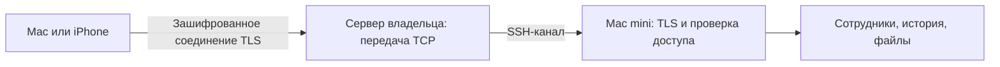

# Подключение Mac mini из другой сети

9 октября 2026 года. Исправлена рабочая конфигурация установленного OpenStrudel 1.0 (27). Пересборка приложения для этой настройки не требуется.

## Причины сбоя

1. Обновление LaunchAgent теряло внешний адрес, заданный в его окружении. Новая ссылка указывала на `.local`, который не доступен из другой сети.
2. После обрыва SSH старый серверный сеанс продолжал удерживать внешний порт. Новый сеанс Mac mini не мог его занять. Общая серверная проверка связи занимала до десяти минут.

Внешний адрес теперь сохранён в `.env` постоянного каталога данных. Новые ссылки Mac mini используют его по умолчанию. Генератор LaunchAgent также сохраняет прежние настройки внешнего адреса и путей TLS при обновлении приложения.

Для ограниченного пользователя ретранслятора установлены `ClientAliveInterval 20` и `ClientAliveCountMax 3`. На Mac уже действуют соответствующие проверки сервера. Старый неисправный сеанс закрыт отдельно; launchd восстановил канал. Остальные настройки SSH, аккаунты и приложения сервера не менялись.

## Модель доступа

TLS завершается на Mac mini. Сервер передаёт зашифрованный трафик и не получает закрытый ключ Mac или ключи доступа приложения. Клиент проверяет TLS-идентичность по отпечатку из приглашения перед отправкой своего ключа. Данные сотрудников остаются на Mac mini.

Приглашение содержит случайный 256-битный ключ, действует пять минут и позволяет подключить одно устройство. Получатель не проходит дополнительную проверку личности: любой обладатель ещё действующей ссылки может использовать предоставленный ею доступ. В интерфейсе владельца такая ссылка предназначена для его собственного второго устройства.

После подключения устройство получает отдельный ключ. Повторный запрос того же незавершённого подключения может восстановить потерянный сетевой ответ; другое устройство повторно использовать ссылку не может. Отзыв ключа прекращает доступ и не позволяет восстановить его через старое приглашение. Устройства можно отключать по отдельности.

## Проверки

- TypeScript: без ошибок. Runtime: 297 тестов, 46 файлов, все прошли.
- Регрессионная проверка установщика: адрес, порт и пути TLS сохраняются; путь новой программы обновляется; постоянный `.env` остаётся на месте при успешном обновлении и повторе после ошибки.
- Проверки протокола: истечение и замена приглашения, однократное использование, повтор потерянного ответа, роли устройств, отзыв ключа, отказ при подмене TLS до отправки заголовков авторизации.
- Реальный запрос с отдельного Linux-сервера вне сети Mac mini: подключение по свежей ссылке, получение списка 42 сотрудников, запрет анонимного доступа и неправильного ключа, запрет запросов с чужого веб-сайта, запрет повторного использования ссылки другим устройством и проверка ограниченной роли.
- Проверочное устройство вышло; старый ключ и повтор подключения с ним получили отказ. Список подключений вернулся к исходному состоянию. Проверочные файлы на внешнем сервере удалены.
- Проверена фактическая конфигурация SSH для ретранслятора. Остальные настройки SSH совпадают с исходными. После закрытия неисправного сеанса появился новый, HTTPS снова стал отвечать.
- Перед изменением рабочего Home создан согласованный резервный снимок; настройка заменена атомарно. SQLite integrity OK, сохранены 42 сотрудника, 54 чата, 3901 сообщение, 15 расписаний и привязки Telegram. После проверки снимок отмечен исправным.
- Серверная конфигурация также сохранена перед заменой, проверена через `sshd -t` и применена перезагрузкой конфигурации точного сервиса. Для неуспешной проверки предусмотрен откат.

Проверено соединение через интернет, но это не обещание доступности из любой сети с любыми ограничениями. Mac mini и сервер должны быть включены и доступны. Новая установка без настроенного внешнего адреса или частной сети по-прежнему требует первоначальной настройки транспорта; автоматическое предоставление серверов этим исправлением не добавляется.

Приватные квитанции, журналы и результаты находятся в `.data/remote-access-2026-10-09/`. Приглашения и ключи доступа не включены в репозиторий.
